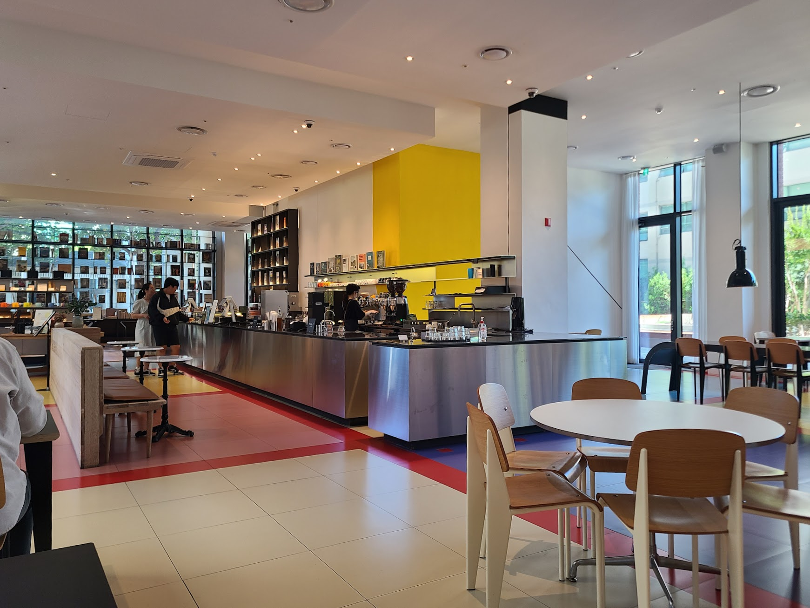
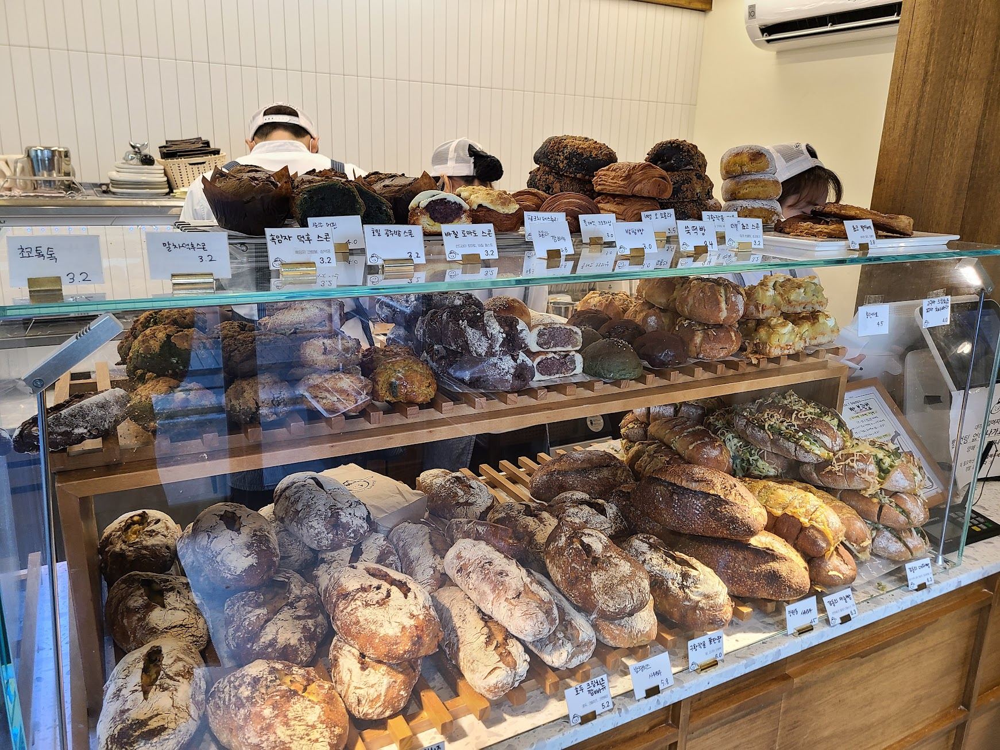
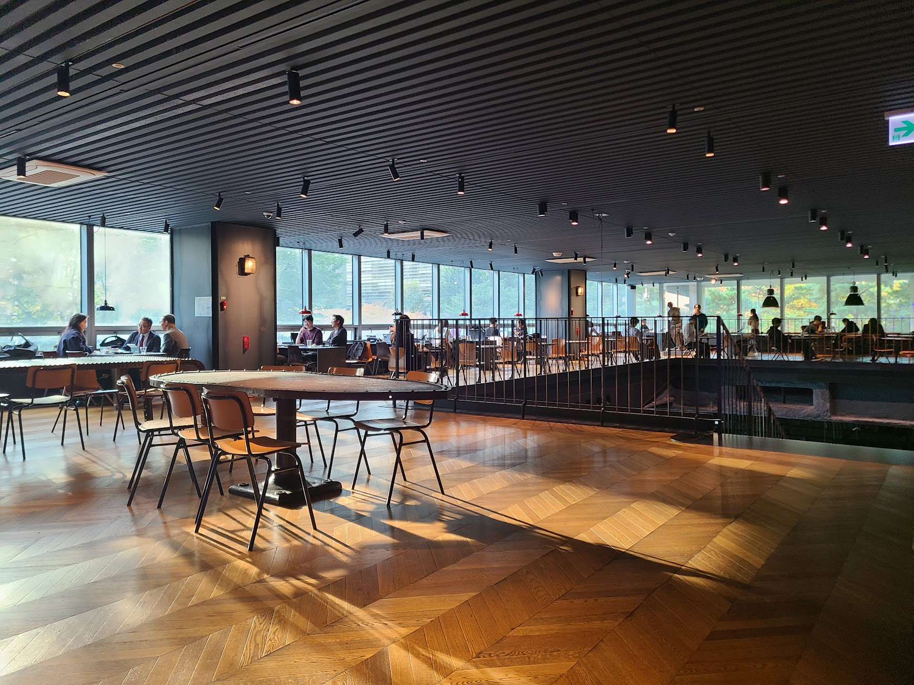

## 문제 1

Q: 다음 이미지에 대한 설명 중 옳지 않은 것은 무엇인가요?
- (1) 많은 사람들이 테이블에 앉아 컴퓨터 작업을 하고 있는 모습입니다.
- (2) 큰 스크린에 "DIVE 2024 IN BUSAN"이라는 문구가 보입니다.
- (3) 참가자 중 일부는 노트북을 사용하고 있습니다.
- (4) 사람들이 체육관에서 운동을 하고 있습니다.

Listening: Which of the following descriptions of the image is incorrect?
- (1) Many people are sitting at tables working on computers.
- (2) A large screen displays "DIVE 2024 IN BUSAN".
- (3) Some participants are using laptops.
- (4) People are exercising in a gym.

정답: (4) 사람들이 체육관에서 운동하고 있는 것이 아니라, 회의나 이벤트에 참여하고 있는 모습입니다.

-------------------------------

## 문제 2

Q: 다음 이미지에 대한 설명 중 옳지 않은 것은 무엇인가요?
- (1) 몇몇 사람들이 카운터에서 음료를 주문하고 있습니다.
- (2) 내부에는 노란색 벽이 있습니다.
- (3) 카페의 테이블이 꽉 차 있습니다.
- (4) 천장에는 많은 조명이 설치되어 있습니다.

Listening: Which of the following descriptions of the image is incorrect?
- (1) Some people are ordering drinks at the counter.
- (2) There is a yellow wall inside.
- (3) The tables in the cafe are fully occupied.
- (4) There are many lights installed on the ceiling.

정답: (3) 카페의 테이블은 비어 있습니다.

-------------------------------

## 문제 3

Q: 다음 이미지에 대한 설명 중 옳지 않은 것은 무엇인가요?
- (1) 다양한 종류의 빵이 진열되어 있습니다.
- (2) 점원은 모자를 쓰고 있습니다.
- (3) 진열대 위에는 가격표가 붙어 있습니다.
- (4) 진열대 뒤에 커피 머신이 보입니다.

Listening: Which of the following descriptions of the image is incorrect?
- (1) Various types of bread are displayed.
- (2) The clerk is wearing a hat.
- (3) There are price tags on the display.
- (4) A coffee machine is visible behind the display.

정답: (4) 진열대 뒤에 커피 머신이 보이지 않습니다.

-------------------------------

## 문제 4

Q: 다음 이미지에 대한 설명 중 옳지 않은 것은 무엇인가요?
- (1) 창문을 통해 바깥의 풍경이 보입니다.
- (2) 사람들이 여러 테이블에 앉아 있습니다.
- (3) 천장에 조명이 없습니다.
- (4) 바닥은 나무로 되어 있습니다.

Listening: Which of the following descriptions of the image is incorrect?
- (1) The view outside can be seen through the windows.
- (2) People are sitting at various tables.
- (3) There are no lights on the ceiling.
- (4) The floor is made of wood.

정답: (3) 천장에 조명이 없습니다. (사실은 조명이 있습니다.)

-------------------------------

